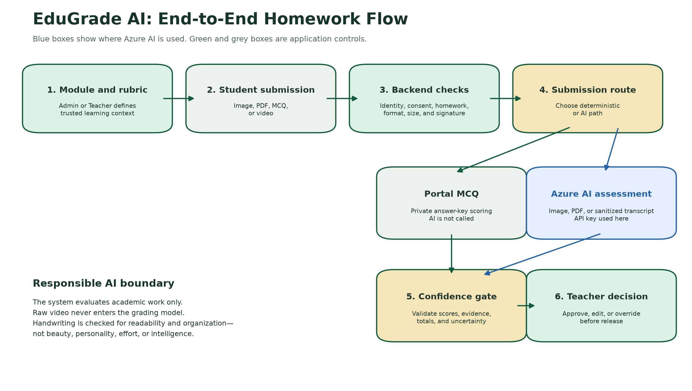
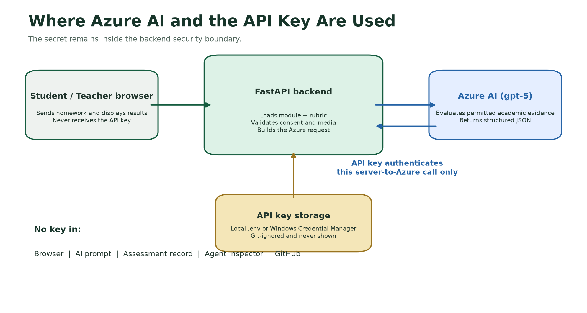
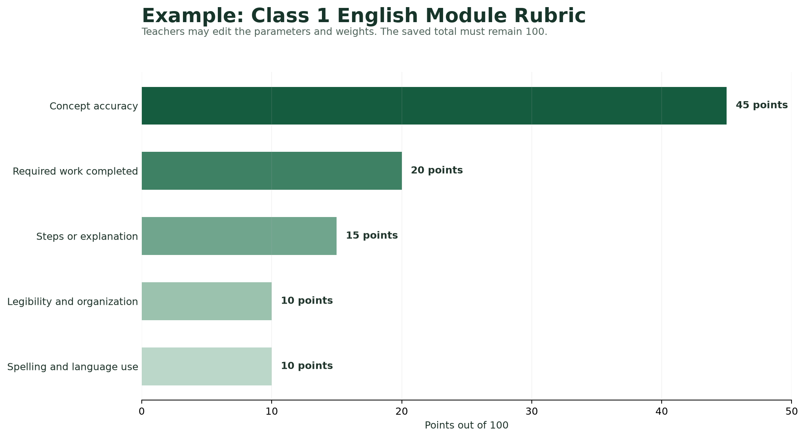

# EduGrade AI Agent: How It Works

## Purpose

EduGrade AI helps teachers evaluate assigned homework consistently. It combines:

- Teacher-approved learning modules
- Class- and subject-specific evaluation rubrics
- Handwritten image and PDF assessment
- Portal MCQs
- Locally transcribed video homework
- Responsible AI controls
- Teacher review before feedback is released

The AI evaluates the **submitted academic work**. It does not evaluate the child's
intelligence, personality, appearance, voice, character, motor ability, or future
potential.

## End-to-end workflow

1. An Admin uploads or selects a learning module.
2. EduGrade creates a starting rubric based on the class and subject.
3. An Admin or Teacher reviews and edits the rubric.
4. The student selects the assigned homework.
5. The student submits a handwritten image, handwritten PDF, portal MCQ, or video.
6. The FastAPI backend verifies registration, consent, homework, file type, file
   size, and allowed submission format.
7. Portal MCQs are scored directly from the private answer key. AI is not used.
8. Handwritten images and PDFs are sent to Azure AI with the trusted module,
   homework instructions, and rubric.
9. Raw video is never sent to the grading model. The local FastAPI app runs
   Faster-Whisper as a background job, and only its transcript and local-processing
   reference can enter the AI assessment step.
10. EduGrade validates the AI response, calculates confidence, and routes the
    result to the Teacher.
11. The Teacher selects the class and subject to view the real dashboard, then
    optionally selects a module for roster-level submission review.
12. The Teacher inspects retained handwritten evidence, confirms or edits every
    rubric parameter, and approves, edits, or overrides the feedback.
13. Only teacher-approved bilingual feedback is released in the Student workspace.
14. The local owner Agent Inspector retains recent execution traces and failed-run
    details so the last run is always available for troubleshooting.
15. The Student dashboard uses the learner's registered class to show work due
    today, available class assignments, submission progress, and approved outcomes.
    Longitudinal report cards remain a future capability and must use
    teacher-approved evidence without identity or personality inference.

## Where AI and the API key are used

The Azure AI API key is used only inside the FastAPI backend when it creates the
secure request to the Azure OpenAI-compatible Responses API.

The key:

- Is loaded from the local `.env` file or Windows Credential Manager
- Is never sent to the browser
- Is never included in the student submission or AI prompt
- Is never written to assessment records
- Is never displayed in the Agent Inspector
- Is never committed to GitHub

The backend uses the key to authenticate the model request. Azure AI then receives
the learning module, homework instructions, rubric, and permitted academic
submission. The model returns structured criterion scores, evidence, feedback,
and confidence.

## Where AI is not used

| Activity | AI used? | How it works |
|---|---|---|
| Email OTP verification | No | Server-generated one-time verification flow |
| Parent consent check | No | Stored profile and consent record |
| Homework and module lookup | No | Trusted application catalog |
| File type and size validation | No | Backend validation |
| Portal MCQ scoring | No | Private answer-key comparison |
| Raw video processing | No grading AI | Local background Faster-Whisper boundary |
| Handwritten image evaluation | Yes | Azure AI evaluates academic evidence |
| Handwritten PDF evaluation | Yes | Azure AI evaluates academic evidence |
| Sanitized video transcript evaluation | Yes | Azure AI evaluates transcript text only |
| Final approval | No | Teacher decision |

## How the rubric is created

Every module receives its own 100-point rubric. The starting parameters are based
on the student's class, subject, module content, and evidence that can be observed
in the homework.

For a Class 1 English module, the starting rubric is:

| Evaluation parameter | Points | Meaning |
|---|---:|---|
| Concept accuracy | 45 | Answers reflect the ideas taught in the module |
| Required work completed | 20 | Every requested activity is visibly attempted |
| Steps or explanation | 15 | Simple examples or explanations are shown |
| Legibility and organization | 10 | Work is readable, spaced, and organized |
| Spelling and language use | 10 | Language is appropriate for Class 1 |

These percentages are configurable EduGrade defaults. They are not presented as
official externally mandated percentages. Admins and Teachers can change the parameters,
guidance, and point allocation, but the total must remain 100 points.

## How AI evaluates a submission

For every rubric parameter, the model must return:

- Parameter name
- Score awarded
- Maximum points
- Reason for the score
- Evidence observed in the homework

The backend rejects inconsistent output. Every criterion must match the saved
rubric, individual scores cannot exceed their limits, and all totals and
percentages must calculate correctly.

The model is instructed to assess handwriting only for readability, spacing,
alignment, and organization. It must not reward or penalize handwriting beauty,
decoration, perceived effort, personality, intelligence, or motor development.

## Confidence and teacher control

AI confidence reflects image quality, completeness, clarity of evidence, rubric
clarity, and ambiguity. Low-confidence results are automatically marked for
mandatory Teacher review.

The Teacher can:

- Accept, discard, or remove AI feedback from the working draft
- Inspect retained handwritten images and PDFs
- Confirm or edit every parameter score
- Edit bilingual feedback
- Change the score within the rubric maximum
- Approve the result
- Override the AI assessment

This human review step ensures that AI assists the educator but does not make the
final educational decision independently.
